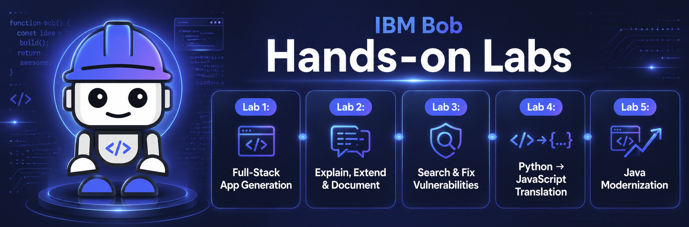

# Hands-on Labs

These hands-on labs are designed to help participants learn how to use IBM Bob across real-world software engineering scenarios. 🚀
Participants will generate, explain, extend, secure, translate, and modernize code while working through practical exercises.

By the end of these labs, participants will have practiced using IBM Bob to support different stages of the development lifecycle, from building new applications to improving existing codebases. 💡

---

### Lab 1: Generate a Full-Stack Application 🧱

* Generate backend code using Python Flask.
* Generate frontend code using JavaScript.
* Create and run unit tests.

### Lab 2: Explain, Extend and Document an Existing Application 📝

* Explain the code of an existing application.
* Generate a new feature for the Lab 1 application.
* Document the application code.

### Lab 3: Search and Fix Vulnerabilities 🔐

* Explain the code of a vulnerable application.
* Identify security issues.
* Fix vulnerabilities in the code.

### Lab 4: Translate Code from Python to JavaScript 🔄

* Analyze an existing Python script.
* Translate the logic into JavaScript.
* Validate the translated version.

### Lab 5: Modernize Legacy Java Code ⚙️

* Analyze a legacy Java 8 application.
* Identify modernization opportunities.
* Modernize the codebase toward Java 17.
