# Lab 1: Building a To Do application with Bob

## Overview

In this lab, you'll learn to use Bob's AI-powered features to build a complete full-stack To Do application from scratch. You'll experience Bob's different modes, auto-approvals, and code generation.

## Before Starting

Make sure you have:
- IBM Bob access
- Python 3.8+
- Node.js 14+
- A terminal
- A local workspace where Bob can create files and run commands


## What You'll Build

A full-stack To Do application with:
- **Backend**: Python Flask REST API with SQLite database
- **Frontend**: Modern JavaScript single-page application
- **Features**: Create, read, update, and delete To Dos

## Lab Structure

- [Set up your project](#step-1-set-up-your-project)
- [Introduction to Bob Modes](#step-2-introduction-to-bob-modes)
- [Backend Development](#step-3-backend-development)
- [Frontend Development](#step-4-frontend-development)
- [Testing & Verification](#step-5-testing--verification)
  
---

## Step 1: Set up your project

### 1.1: Create and open the project folder

Create a new folder on your computer:

```text
bob-lab1
```

Open this folder in IBM Bob.

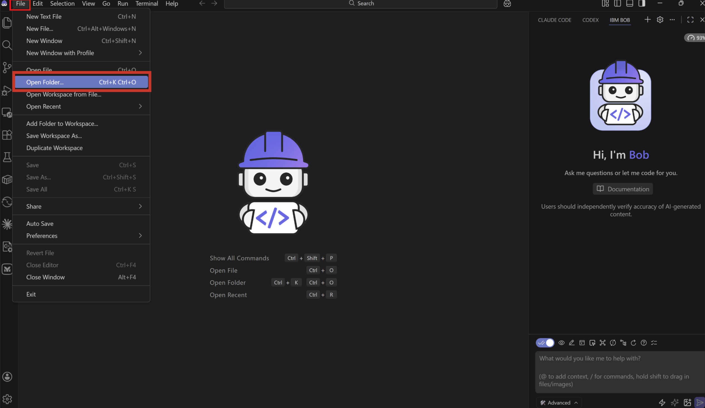

**✅ Checkpoint**: Your workspace is ready to start working.

## Step 2: Introduction to Bob Modes

### 2.1: Understanding Bob Modes

Bob has three built-in modes, each optimized for a different type of task. The built-in modes you'll use in this lab are:

#### 🤖 Agent Mode

**When to use**: Writing, modifying, refactoring, or improving code

* Implement features
* Create new files
* Modify existing code
* Fix bugs
* Refactor code
* Run tools and tests as part of development work

#### 🎯 Plan Mode

**When to use**: Planning, designing, or strategizing before implementation

* Analyze requirements
* Research technical approaches
* Design project structures
* Plan API endpoints
* Plan database schemas
* Make architectural decisions
* Break complex tasks into clear implementation steps

#### ❓ Ask Mode

**When to use**: Learning, understanding, or getting technical help

* Explain code concepts
* Analyze existing code
* Get documentation-style answers
* Understand errors
* Learn best practices
* Ask technical questions without changing code


> **🎯 Bob Differentiator: [Customizable Modes](https://bob.ibm.com/docs/ide/configuration/custom-modes)**

Bob's mode system is one of its key differentiators. Bob allows you to create custom modes tailored to your team's specific workflows.


### 2.2: Plan your project

Switch to **Plan Mode** and ask Bob:

```
I want to create a To Do application with a Python Flask backend and JavaScript frontend.
Please help me plan:
1. Project directory structure
2. API endpoints needed
3. Database schema
4. Technology stack recommendations
```

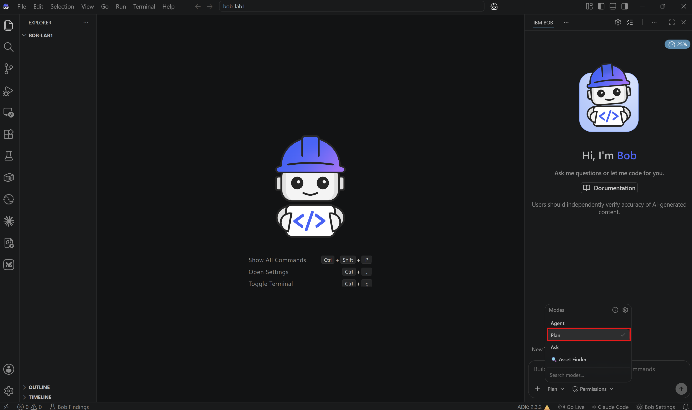

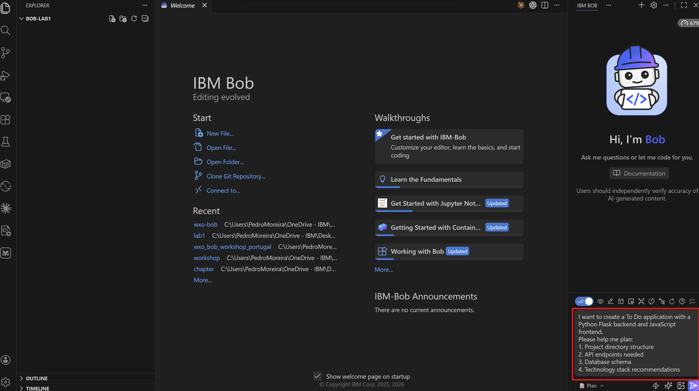


**Bob's Interactive Approach:**

Before providing a plan, Bob will ask clarifying questions to understand your requirements better. This is a key differentiator - Bob lets you drive the process while making helpful suggestions.

Bob might ask:
- "How complex should the application be?"
- "Which database would you prefer (SQLite, PostgreSQL, MySQL)?"
- "Do you need user authentication?"
- "Should we include additional features like categories or priorities?"

**For this lab, respond with basic requirements:**
- Simple/basic complexity
- SQLite database (no installation needed)
- No user authentication
- Basic CRUD operations only

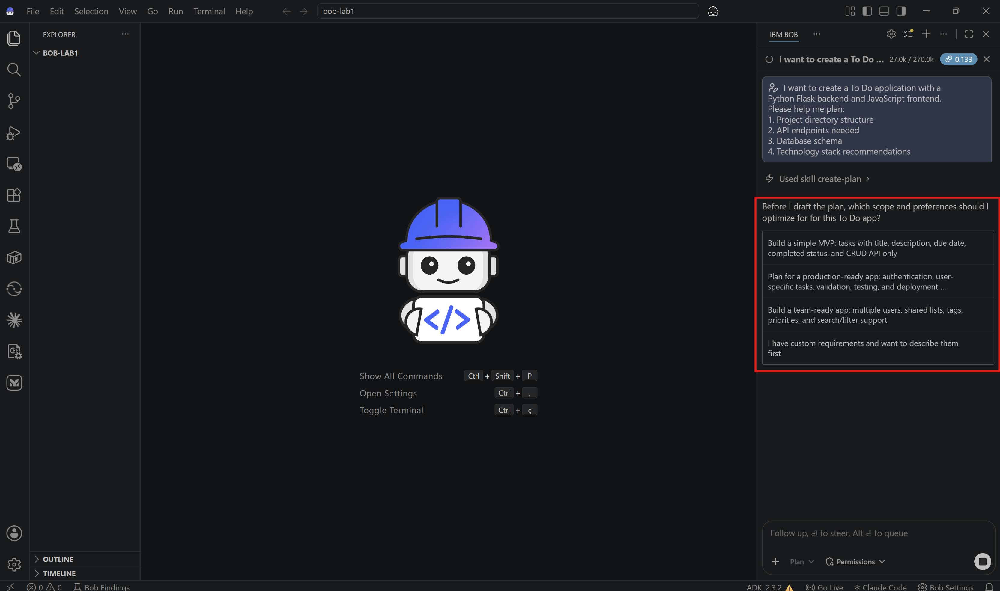

This collaborative approach ensures Bob will build exactly what you need, and will not assume what you want.

**✅ Checkpoint**: Bob provided you with a comprehensive plan that matches your requests.

---

## Step 3: Backend development

Now let's build the backend for your application using Bob's Agent mode.

### 3.1: Switch to Agent Mode

Change from Plan to **Agent mode**.

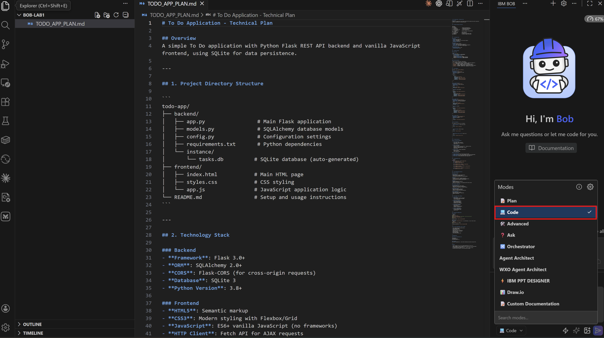

### 3.2: Create the backend structure

**Prompt for Bob:**

```
Create a Flask backend for the To Do app with the following files:
1. app.py - Main Flask application with CORS enabled
2. models.py - SQLAlchemy To Do model
3. database.py - Database initialization
4. requirements.txt - Python dependencies

The To Do model should have: id, title, description, completed (boolean), created_at (timestamp)
```

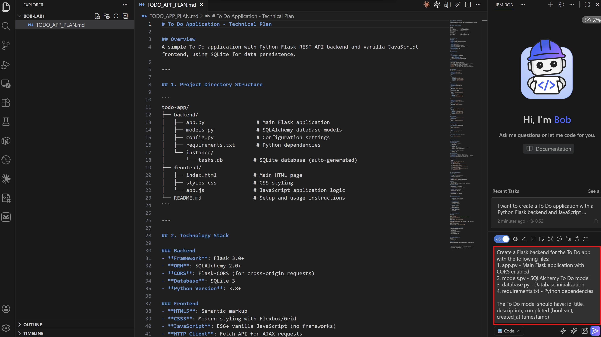

Bob should generate all the necessary files regarding your backend structure. Review each file as Bob creates them.

### 3.3: Implement REST API Endpoints

**Prompt for Bob:**

```
Implement the following REST API endpoints in app.py:
- GET /api/To Dos - List all To Dos
- POST /api/To Dos - Create a new To Do
- PUT /api/To Dos/<id> - Update a To Do
- DELETE /api/To Dos/<id> - Delete a To Do

Include proper error handling and JSON responses.
```

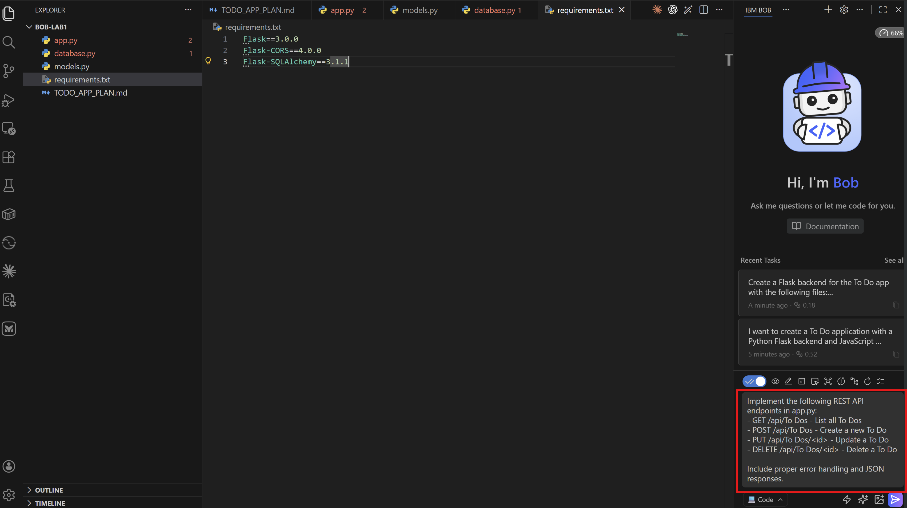

### 3.4 Review Generated Code

As a best practice, you should review all files generated by Bob to verify that the generated code, logic and overall implementation meet your expectations.

Example:

**app.py**:
```python
from flask import Flask, request, jsonify
from flask_cors import CORS
from models import To Do
from database import db, init_db

app = Flask(__name__)
app.config['SQLALCHEMY_DATABASE_URI'] = 'sqlite:///To Dos.db'
app.config['SQLALCHEMY_TRACK_MODIFICATIONS'] = False
CORS(app)

init_db(app)

@app.route('/api/To Dos', methods=['GET'])
def get_To Dos():
    To Dos = To Do.query.all()
    return jsonify([To Do.to_dict() for To Do in To Dos])

@app.route('/api/To Dos', methods=['POST'])
def create_To Do():
    data = request.get_json()
    To Do = To Do(
        title=data.get('title'),
        description=data.get('description', ''),
        completed=False
    )
    db.session.add(To Do)
    db.session.commit()
    return jsonify(To Do.to_dict()), 201

# Additional endpoints...
```

### 3.5: Create Unit Test Cases and run them

Unit test cases are small checks that verify if individual parts of an application are working correctly, helping catch errors early and before they affect the whole application.

**Prompt for Bob:**

```bash
Create unit test cases for each of the api endpoints, and ensure at least 90% code coverage.
```


### 3.6: Run the Backend

Let's ask Bob how to run the backend.

**Prompt for Bob:**

```bash
How can I run the backend application?
```

Bob should quickly identify the necessary commands to run the backend.

<p align="center">
  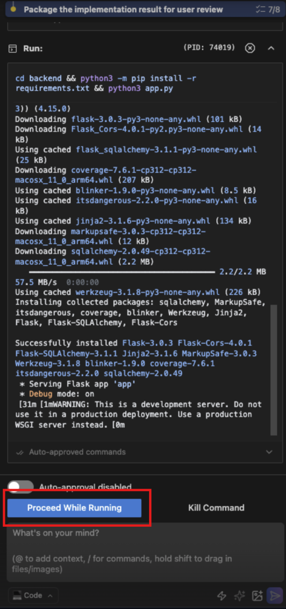
</p>

Follow the instructions and run those commands in your terminal.

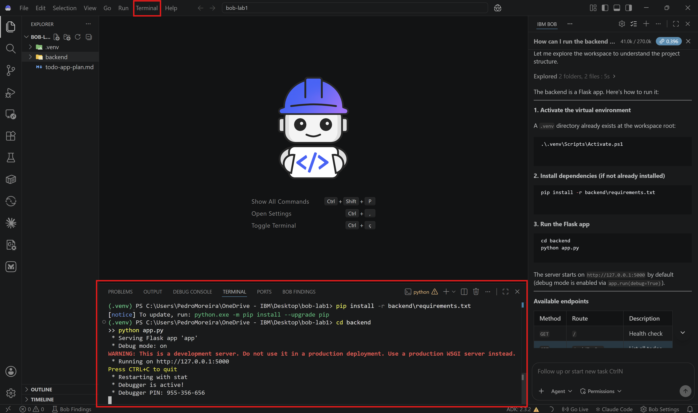


**✅ Checkpoint**: Backend is running without errors.

---

## Step 4: Frontend Development

Now, let's create the frontend (user interface).

### 4.1: Create Frontend Structure

**Prompt for Bob (still in Agent mode):**

```
Create a frontend for the To Do app with:
1. index.html - Main HTML structure with a clean, modern design
2. styles.css - Responsive CSS styling
3. app.js - JavaScript for API interactions

Include:
- Input field for new To Dos
- List to display To Dos
- Buttons for complete and delete actions
- Responsive design for mobile and desktop
```

### 4.2: Understanding Literate Coding

**Literate coding** is the practice of writing code that is self-explanatory through clear structure, meaningful naming conventions, and well-placed comments. The goal is not only to create functional software but also to make the code easy to understand, maintain, and evolve over time. This approach enhances collaboration among developers and helps non-technical stakeholders better understand how the application works and behaves.

**Prompt for Bob:**

```
In app.js, use literate coding to explain:
- How the API calls work
- Why we use async/await
- How error handling is implemented
- The purpose of each function

Add detailed comments that would help a beginner understand the code.
```

### 4.3 Review Frontend Code

As a best practice, you should review all files generated by Bob to verify that the generated code, logic and overall implementation meet your expectations.

Example:

**app.js**:
```javascript
/**
 * To Do Application - Frontend JavaScript
 * 
 * This file handles all interactions between the user interface
 * and the Flask backend API. We use modern JavaScript features
 * like async/await for cleaner asynchronous code.
 */

// API base URL - points to our Flask backend
const API_URL = 'http://localhost:5000/api/To Dos';

/**
 * Fetches all To Dos from the backend API
 * 
 * This function demonstrates the async/await pattern:
 * - 'async' keyword allows us to use 'await' inside
 * - 'await' pauses execution until the promise resolves
 * - This makes asynchronous code look synchronous and easier to read
 * 
 * @returns {Promise<void>}
 */
async function fetchTo Dos() {
    try {
        // Make GET request to backend
        const response = await fetch(API_URL);
        
        // Parse JSON response
        const To Dos = await response.json();
        
        // Update the UI with fetched To Dos
        displayTo Dos(To Dos);
    } catch (error) {
        // Handle any errors (network issues, server errors, etc.)
        console.error('Error fetching To Dos:', error);
        showError('Failed to load To Dos. Please try again.');
    }
}

/**
 * Creates a new To Do item
 * 
 * This function shows how to make a POST request with JSON data.
 * We use the Fetch API which returns promises, making it perfect
 * for async/await syntax.
 * 
 * @param {string} title - The To Do title
 * @param {string} description - The To Do description
 */
async function createTo Do(title, description) {
    try {
        const response = await fetch(API_URL, {
            method: 'POST',
            headers: {
                'Content-Type': 'application/json',
            },
            body: JSON.stringify({ title, description })
        });
        
        if (response.ok) {
            // Refresh the To Do list
            await fetchTo Dos();
            // Clear the input form
            clearForm();
        }
    } catch (error) {
        console.error('Error creating To Do:', error);
        showError('Failed to create To Do. Please try again.');
    }
}

// Additional functions with detailed explanations...
```

### 4.4: Open the frontend 

**For Windows Users**:

Open your application's frontend by right-clicking the `index.html` file and then selecting "Open with Live Server".


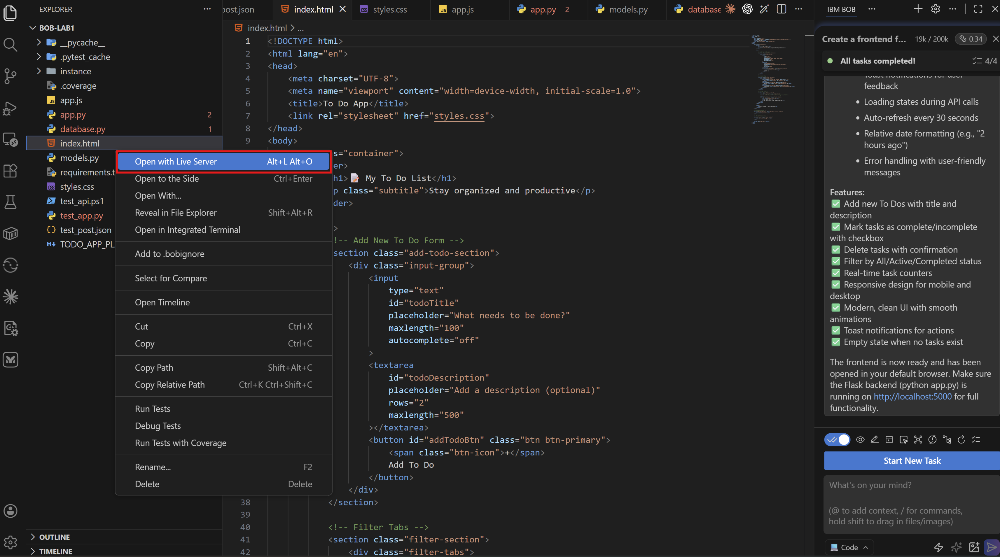

**For macOS Users**:

Right-click the `index.html` file and select "Reveal in Finder"

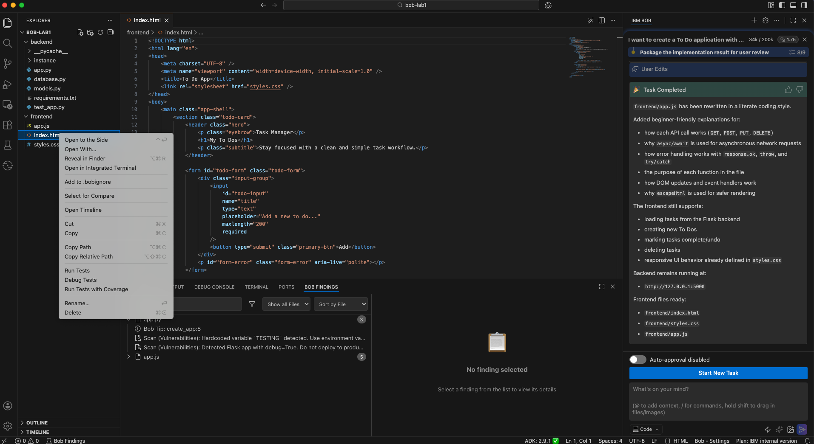

Then just open the file in your browser of choice.


The frontend should now be open, as shown below. Keep in mind that your frontend may look different, since the prompts we provided to Bob were not very detailed. This gave Bob flexibility to make certain implementation and design decisions independently.

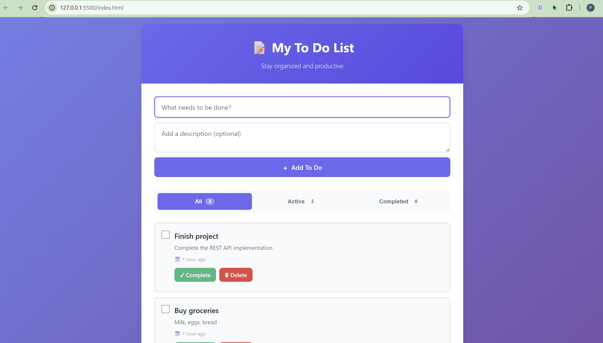


**✅ Checkpoint**: Frontend loads and displays the User Interface.

---

## Step 5: Test your application

Explore and try the frontend you opened in the previous step. Some testing examples:

**Create a To Do:**
1. Enter a title: "Learn Bob"
2. Enter a description: "Complete all three labs"
3. Click "Add To Do"
4. ✅ To Do appears in the list

**Mark as Complete:**
1. Click the "Complete" button on a To Do
2. ✅ To Do shows as completed (strikethrough or checkmark)

**Delete a To Do:**
1. Click the "Delete" button on a To Do
2. ✅ To Do is removed from the list

**Refresh Page:**
1. Refresh the browser
2. ✅ To Dos persist (stored in database)

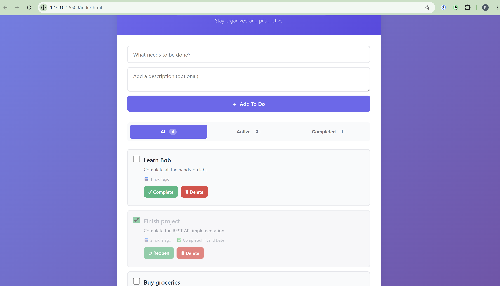


---

## Step 6: Compare your application with the other participants

Do the applications look the same? Are there any differences?

Differences are completely normal and even expected. Since the prompts used in this exercise were intentionally high-level, Bob had flexibility in how certain features and design elements were implemented.

In real projects, teams typically reduce these variations by providing more detailed prompts, design guidelines, and specification/rules files. These artifacts help standardize implementations and ensure greater consistency across applications.

---


# Congratulations 🎉 You’ve reached the end of this lab! 

You've successfully completed this lab! You've learned to:

- ✅ Use Bob modes for different tasks
- ✅ Apply literate coding principles
- ✅ Build a complete full-stack application
