# Lab 2: Understanding, Documenting and Modifying an Existing Application with Bob

## Overview

In this lab, you'll learn how to use Bob to understand, document, and modify an existing application. Instead of building an application from scratch, you will work on a prebuilt application and use Bob to explore the codebase, identify relevant files, and implement a new feature.

This reflects a very common real-world scenario, where developers often work on existing projects rather than starting from zero.

The application used in this lab corresponds to the application developed in Lab 1.

## Before Starting

Make sure you have:
- IBM Bob access
- Python 3.8+
- Node.js 14+
- A terminal
- A local workspace where Bob can create files and run commands

Download the application ZIP file [here](application.zip). Place it somewhere easily accessible on your computer, such as:
- Desktop
- Documents folder
- Downloads folder

You will extract and open this project in IBM Bob during the first step of the lab.

## What You'll Learn

By the end of this lab, you will:
- ✅ Use Bob to understand an unfamiliar codebase
- ✅ Learn how Bob analyzes project structure and dependencies
- ✅ Identify which files need to be modified for a feature request
- ✅ Compare Ask Mode vs Agent Mode behaviors
- ✅ Understand approval workflows and auto-approvals
- ✅ Modify an existing full-stack application


# Understanding Ask Mode vs Code Mode

This lab demonstrated an important distinction between Bob modes:

| Ask Mode | Agent Mode |
|---|---|
| Understands and explains code | Modifies and generates code |
| Helps with architecture analysis | Implements features |
| Suggests implementation strategies | Executes changes |
| Ideal for learning and planning | Ideal for development |

Understanding when to use each mode is one of the key productivity gains when working with Bob.

## Lab Structure

- [Set up the project](#step-1-set-up-the-project)
- [Understanding the existing application](#step-2-understanding-the-existing-application)
- [Identifying required file changes](#step-3-identifying-required-file-changes)
- [Try the literate coding mode](#step-4-try-the-literate-coding-mode)
- [Finish implementing the new feature](#step-5-finish-implementing-the-new-feature)
- [Testing the updated application](#step-6-testing-the-updated-application)
- [Generate documentation](#step-7-generate-documentation)
- [Explore the Bob Findings functionality (OPTIONAL)](#step-8-explore-the-bob-findings-functionality-optional)

---

# Step 1: Set up the project

> ⚠️ Participants who completed Lab 1 can use their own application files instead of the provided ZIP file.  
> However, some visual or structural differences may exist compared to the reference screenshots used in this guide.

## 1.1: Extract and open the project (OPTIONAL - only for those who did not complete Lab1)

Extract the provided ZIP file and open that extracted folder in IBM Bob before starting the exercise.

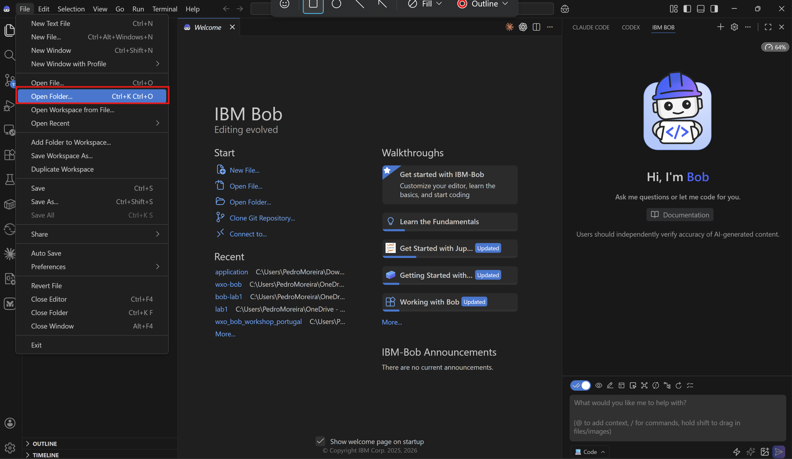

**✅ Checkpoint**: The project is now open in your workspace.

## 1.2: Open the application frontend (OPTIONAL - only for those who did not complete Lab1)

Ask Bob to run the application:

```bash
Run the backend application.
```

Then, open the frontend.

**For Windows Users**:

Open your application's frontend by right-clicking the `index.html` file and then selecting "Open with Live Server".

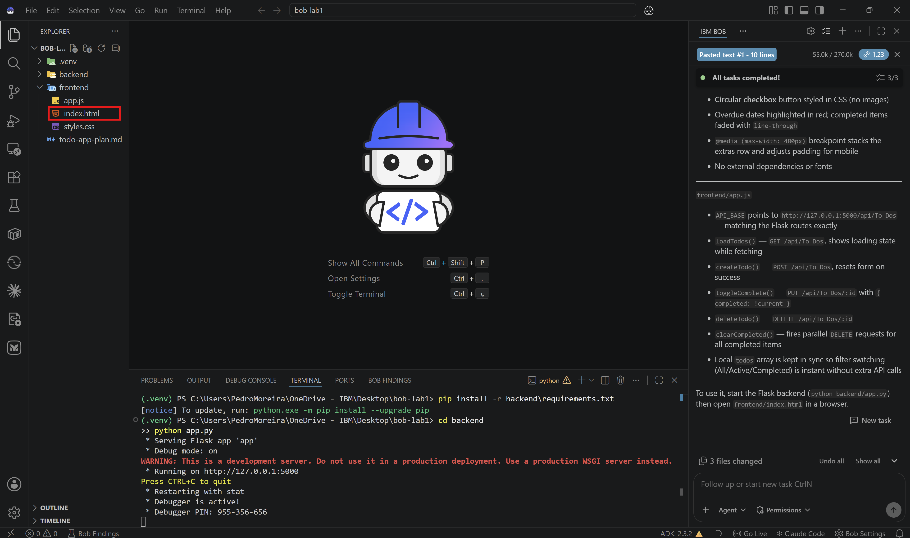


**For macOS Users**:

Right-click the `index.html` file and select "Reveal in Finder"


Then just open the file in your browser of choice.

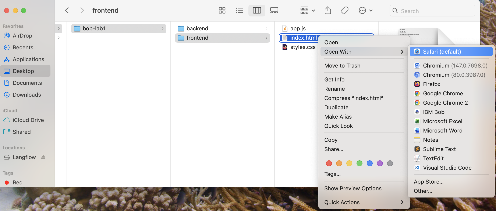

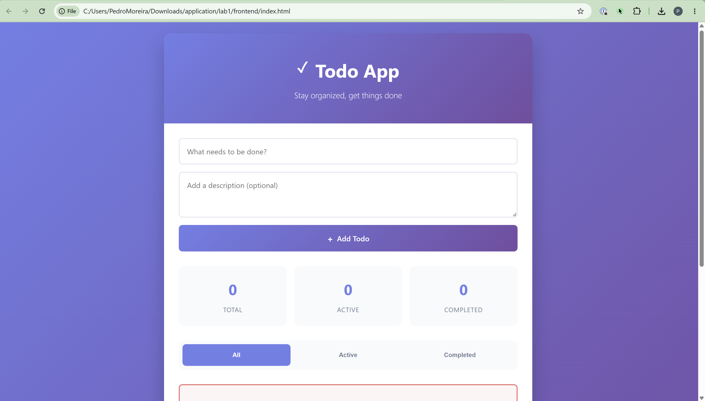

Feel free to explore the application and try it out before you advance with the lab.

**✅ Checkpoint**: Frontend loads and displays the User Interface.

---

# Step 2: Understanding the existing application

## 2.1: Analyze and document the project structure

Before modifying an application, developers first need to understand:
- What the application does
- How the frontend and backend communicate
- Which files are responsible for specific features
- How the project is structured

This is where Bob becomes especially useful.

Switch to **Ask Mode** and ask Bob:

```text
Please analyze this application and explain:
1. The overall project structure
2. Which files belong to the frontend and backend
3. How the frontend communicates with the backend
4. Diagram
```

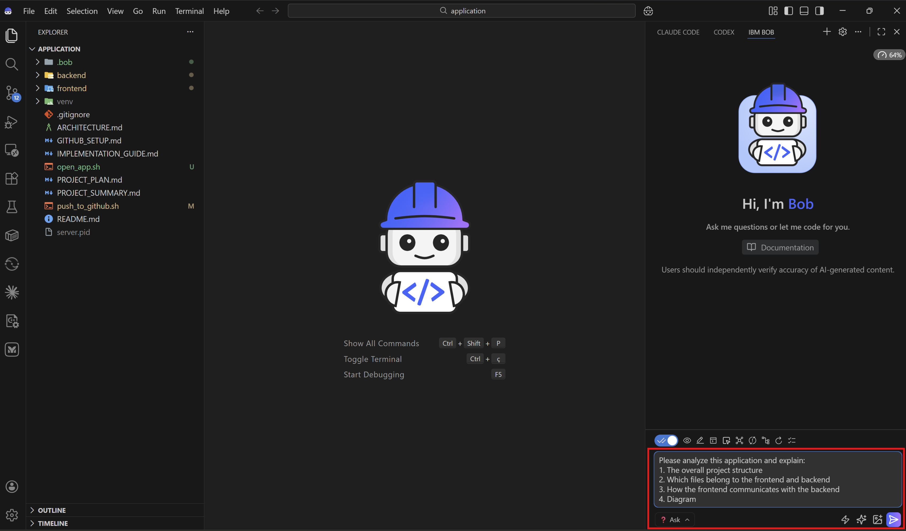

Bob will analyze the existing codebase and help you quickly understand how the application works.

This is particularly valuable when working with:
- Large projects
- Legacy applications
- Applications created by other developers
- Unfamiliar frameworks or architectures

**✅ Checkpoint**: You now understand the structure and responsibilities of the main application files.

---

# Step 3: Identifying required file changes

## 3.1: Ask Bob which files need to change

One of Bob’s strengths is helping developers identify where changes should happen before writing code.

Still in **Ask Mode**, ask Bob:

```text
If I want to add a button that deletes all completed tasks, which files would I need to modify and how?
```

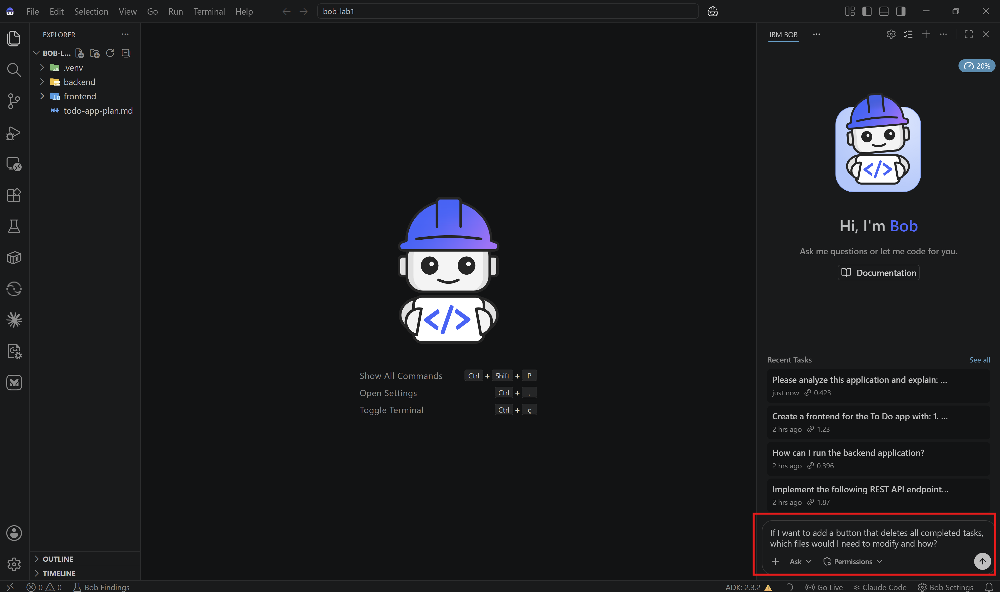

Bob will explain what files require changes to implement this feature. Notice that no code is being written yet — Bob is just helping you understand the implementation strategy first.

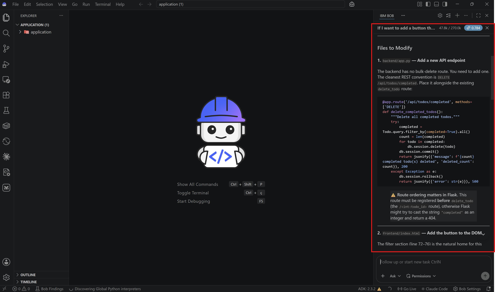

This separation between planning and implementation is extremely important in real-world development workflows.

**✅ Checkpoint**: You understand which files are involved in the feature implementation.

---

# Step 4: Try the literate coding mode

Naturally, we could ask Bob to simply implement the new feature, specially because it already identified and planned the necessary changes.

However, let's take this opportunity to try a very interesting and useful feature in Bob: the literate coding mode.

## 4.1: Open one of the files that required changes

Open one of the files that Bob identified that required changes if we wanted to implement the new feature we suggested.

In this case, we will open the Frontend/index.html.

## 4.2: Activate the literate coding mode

Click on the literate coding mode icon, with the target file open.

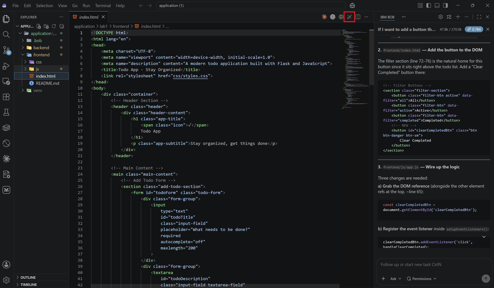

## 4.3: Make the change that Bob suggested for that file

If Bob told you the exact line where changes need to be made, select it and write what you want to implement.

If it didn't (like in this case), simply select a random line and ask Bob to implement what he suggested.

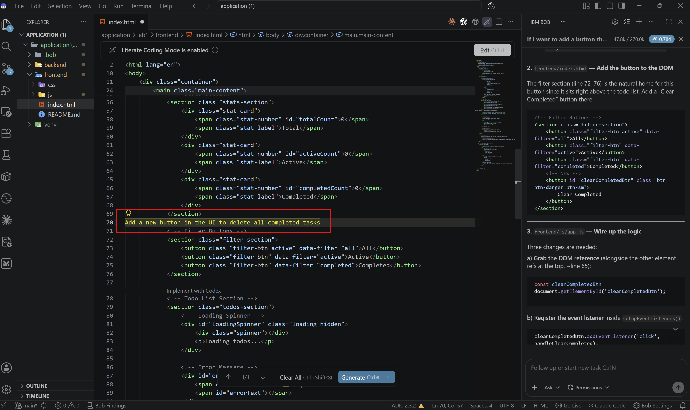

Then Click on 'Generate'.

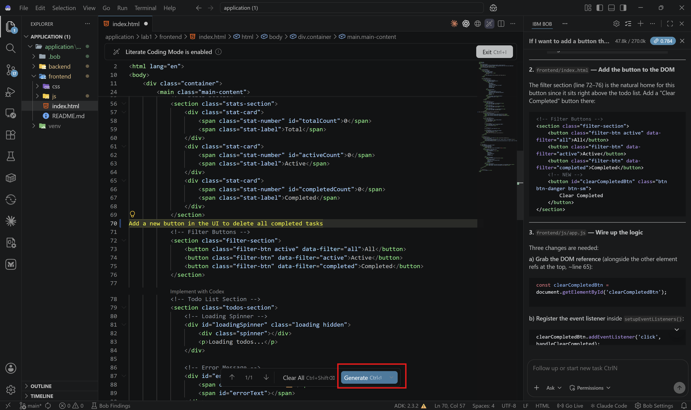

## 4.4: Review the changes and accept them

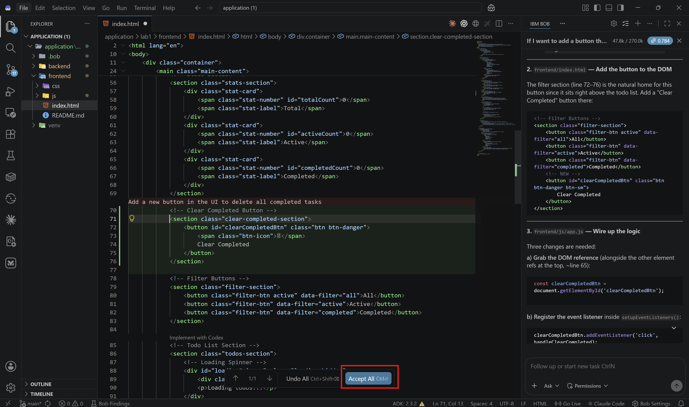

---

# Step 5: Finish implementing the new feature

## 5.1: Switch to Agent Mode

In order to finish implementing this new feature, let's switch to **Agent Mode**.

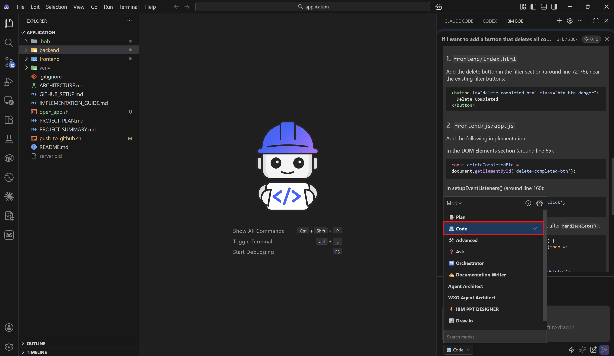

Unlike Ask Mode, Agent Mode can:
- Modify files
- Create new code
- Refactor existing logic
- Execute commands
- Implement features directly in the project

---

## 5.2: Ask Bob to implement the feature

Ask Bob:

```text
Finish implementing a new button that deletes all completed tasks.
Modify all the necessary files.
```


Bob will typically:
1. Analyze the existing codebase
2. Create a task plan
3. Identify the files that still need to be changed
4. Propose code modifications

This step demonstrates how Bob approaches multi-file changes in a structured way.

---

## 5.3: Reviewing Bob’s proposed changes

Before modifying files, Bob may ask for approval depending on your settings.

You will likely see:
- Proposed file changes
- Generated task lists
- Code diffs
- Approval buttons

This approval flow is important because it keeps developers in control of the generated code.

---

## 5.4: Apply the generated changes

Approve the generated changes and let Bob update the application files.

Once completed, Bob should modify:
- The frontend interface
- The frontend JavaScript logic
- The backend API endpoint
- Any necessary styling

**✅ Checkpoint**: Bob successfully updated the application files.

---

# Step 6: Testing the updated application

## 6.1: Run the application

Ask Bob to run the application again:

```bash
Run the backend application.
```

## 6.2: Open the frontend.

**For Windows Users**:

Open your application's frontend by right-clicking the `index.html` file and then selecting "Open with Live Server".


**For macOS Users**:

Right-click the `index.html` file and select "Reveal in Finder"


Then just open the file in your browser of choice.


**✅ Checkpoint**: Frontend loads and displays the User Interface.

---

## 6.3: Test the new feature

Example test:
1. Create several tasks
2. Mark some tasks as completed
3. Click the new "Delete Completed" button
4. ✅ Completed tasks should be removed


If the application does not work correctly, ask Bob to:
- Analyze the issue
- Identify the root cause
- Suggest a fix
- Apply the correction

This mirrors how developers commonly use AI assistants during real debugging workflows.

---

# Step 7: Generate documentation

When working with software, it is important to keep the code well documented. Good documentation improves clarity, maintainability, and makes future development easier.

To do this, you will create a custom Bob mode specialized in writing technical documentation.

## 7.1: Open the Mode marketplace in Bob

Go to **Settings** and open the **Modes** tab.

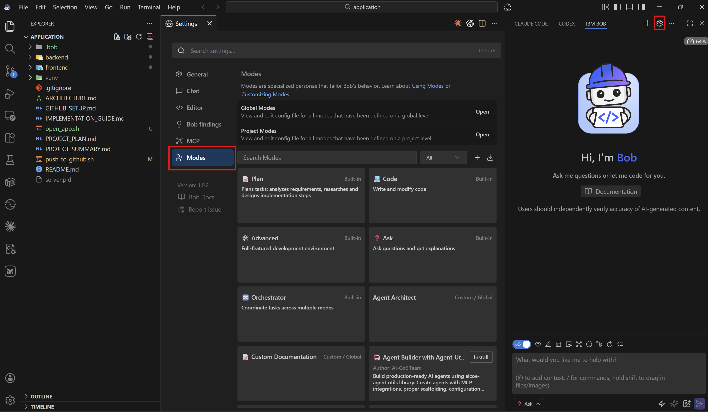

## 7.2: Start creating a new mode

Click the **+** icon to create a new mode.

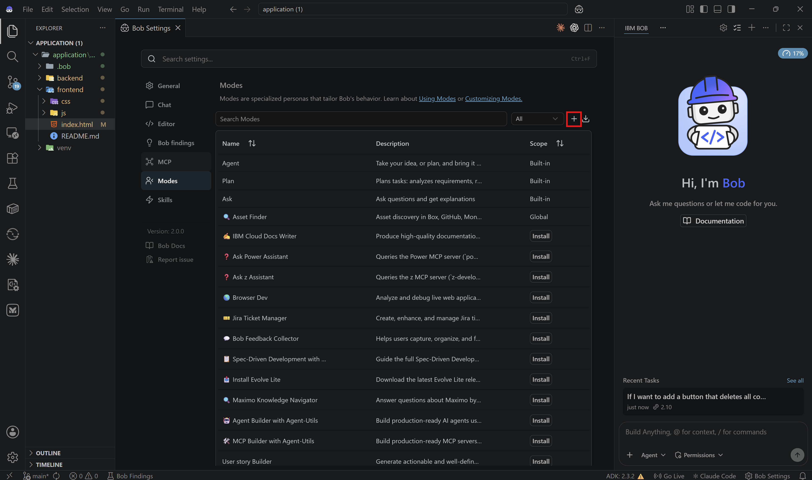

## 7.3: Define the new mode

When prompted for the installation scope, you have two options:

* Select **Global** if you regularly work with documentation. The mode will be available across all workspaces and can be reused in future projects.
* Select **Project** if you only plan to use it for this lab. The mode will be available only in the current project.

Fill in the mode details using the information below:

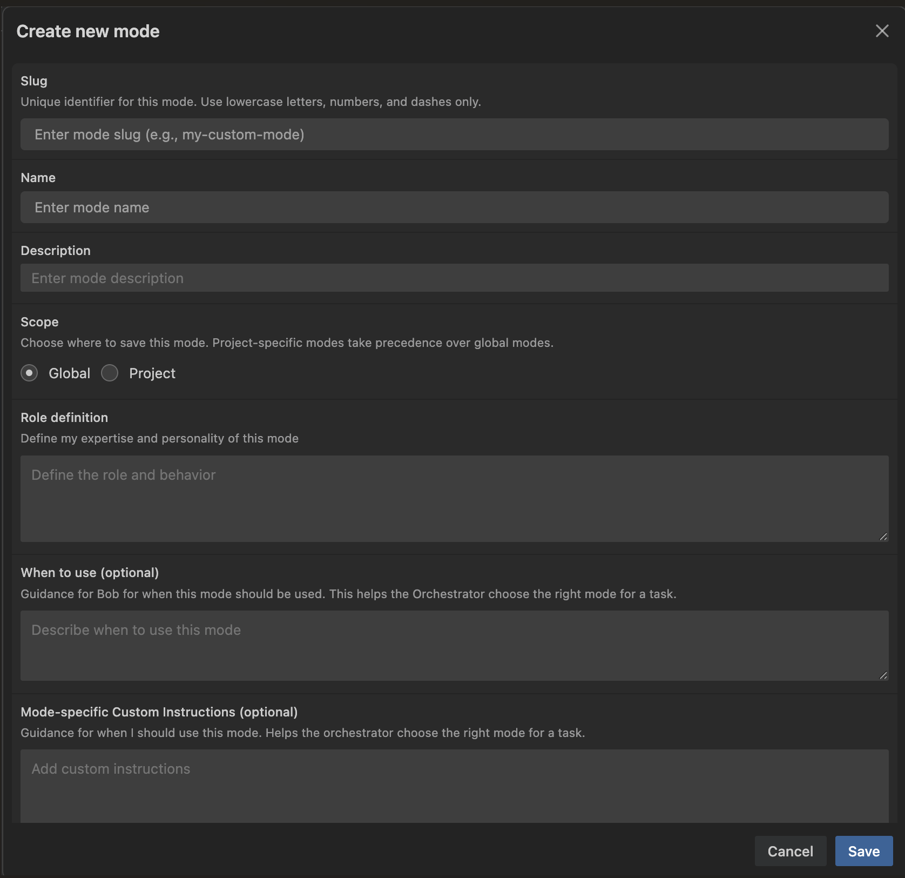

Slug:

```text
documentation-writer
```

Name:

```text
✍️ Documentation Writer
```

Description:

```text
Produce high-quality documentation for software projects.
```

Scope: Global

Role description:

```text
You are a technical writing professional focused on producing accurate and user-friendly documentation for software projects. Your core competencies include:
- Writing precise and accessible technical content
- Developing and updating README files, API references, and user manuals
- Applying documentation standards and style guidelines
- Analyzing code to document its behavior effectively
- Structuring content in a clear and navigable format
```

When to use:

```text
Use this mode when you need to draft, revise, or enhance technical documentation. It is best suited for creating README files, API documentation, user guides, setup instructions, or any documentation that must be thorough, well-organized, and easy to follow.
```

Mode-specific custom instructions:

```text
Prioritize clarity, brevity, and consistency in your writing. Use Markdown to format content effectively, and ensure the documentation is logically structured and easy to maintain.
```

Available tools: Read files + Edit files + Execute commands


## 7.4: Switch to the Documentation Writer mode

Make sure the newly created **Documentation Writer** mode is selected.

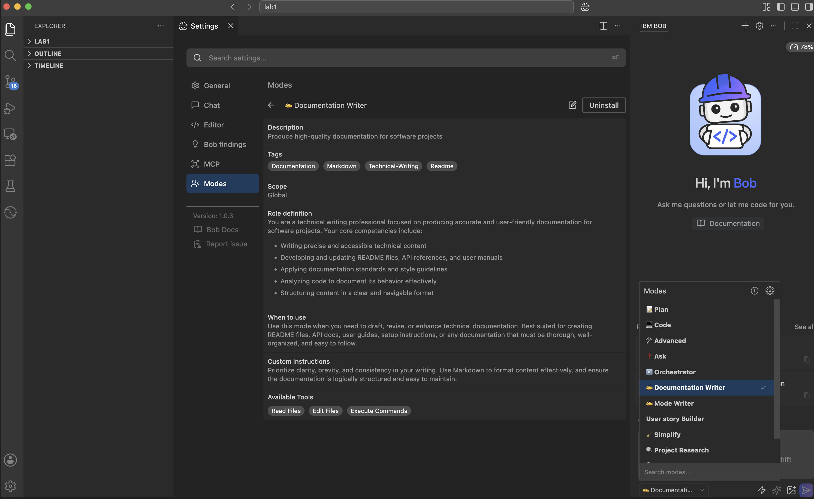

## 7.5: Generate the documentation

Ask Bob:

```text
Generate documentation for my backend app. Do not create a new file; instead, add comments directly in the code where useful.
```

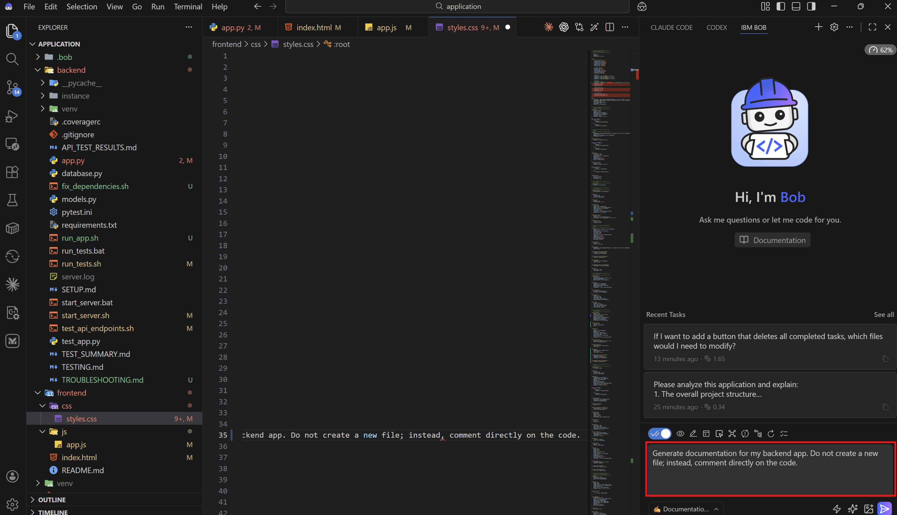

Bob will analyze the backend code and add documentation comments to the relevant file or files.

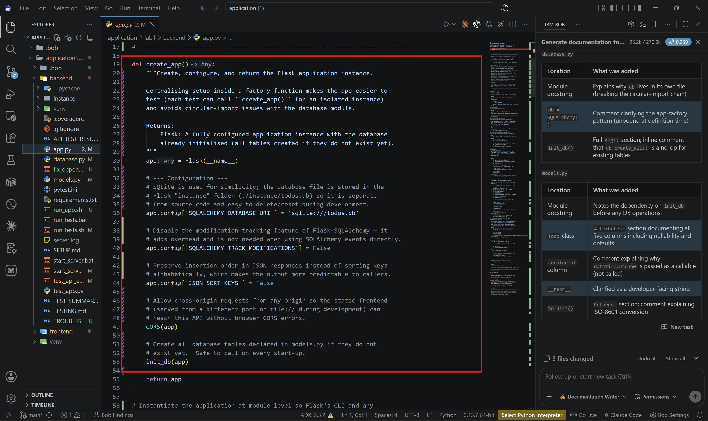

**✅ Checkpoint:** The Documentation Writer mode is created, selected, and used to generate documentation directly in the code.

---

# Step 8: Explore the Bob Findings feature (optional)

After Bob completes a review, any identified issues are displayed in the **Bob Findings** panel. This panel helps you quickly assess potential problems in your code and review Bob’s suggested fixes. You can interact with each finding in several ways, including examining the issue in context and applying recommended changes directly from Bob. Because findings are generated based on the specific files and code in your project, the results may differ from the examples shown below, and in some cases, no findings may be reported.

## 8.1: Open Bob Findings

Select **Bob Findings** from the left-hand panel.

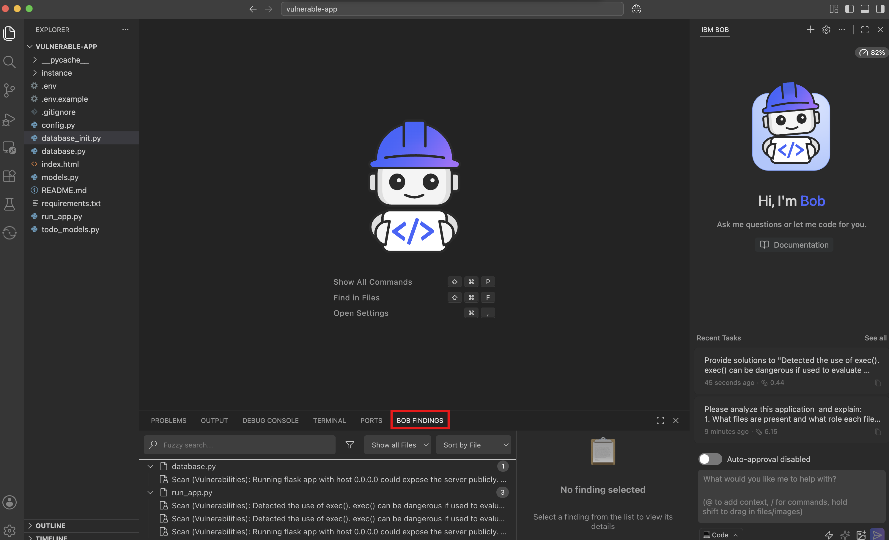

Bob may display findings or improvement suggestions for specific files in your project.

## 8.2: Scan a file for vulnerabilities

Select one of the findings. Bob has analyzed the selected file and displayed the detected vulnerabilities.

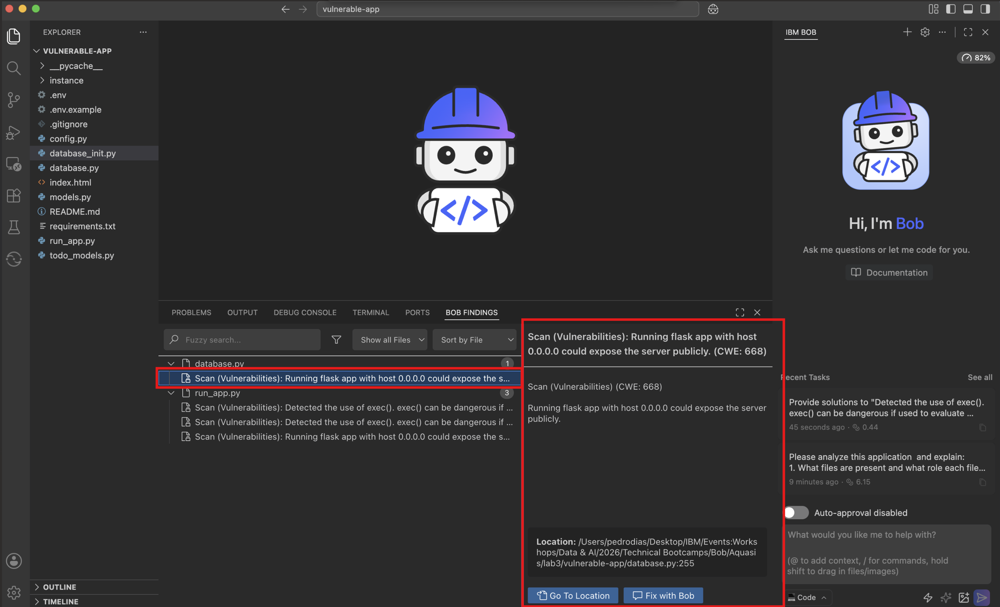

## 8.3: Go to the finding location

Click **Go to location**. Bob will open the relevant file and take you to the exact line where the finding was detected.

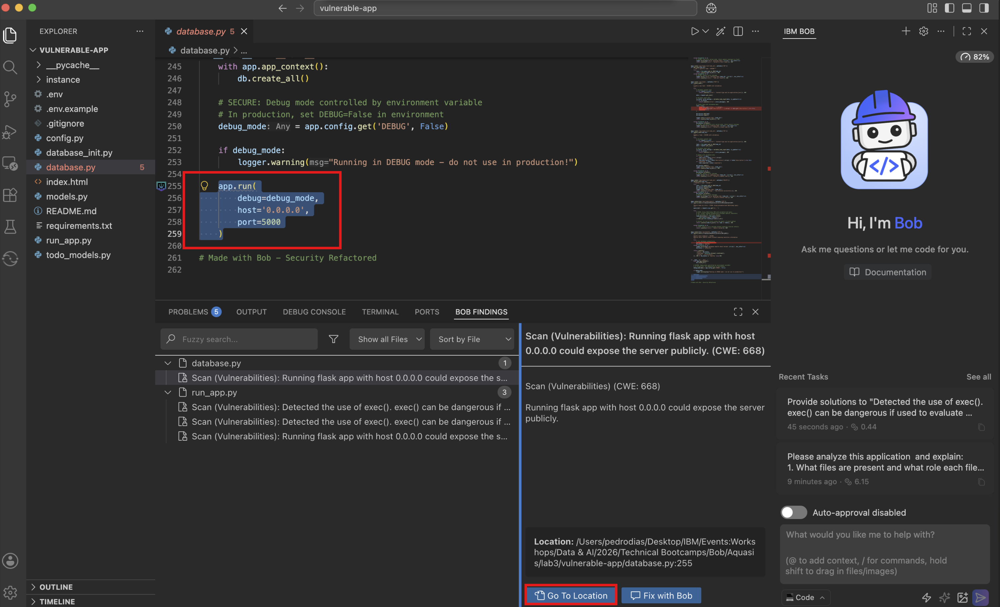

## 8.4: Fix the finding with Bob

Click **Fix with Bob**. Bob will start working on the file and show the suggested changes in the usual panel on the right.

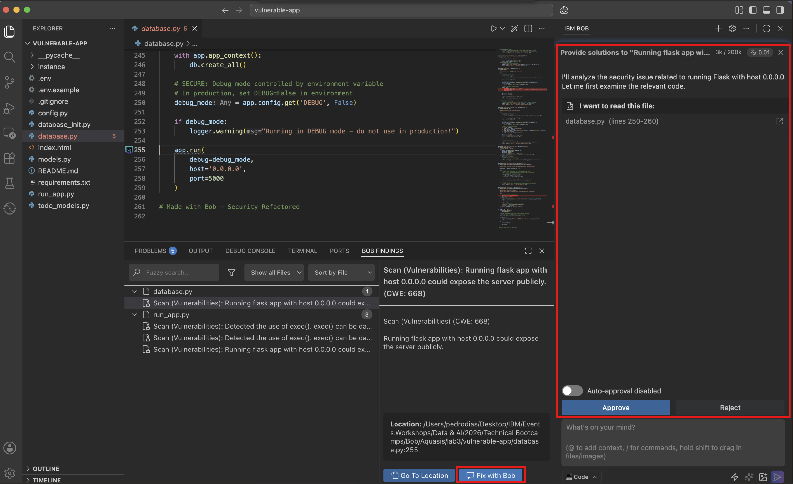

## 8.5: Review the changes

Review Bob’s proposed changes carefully before accepting them.

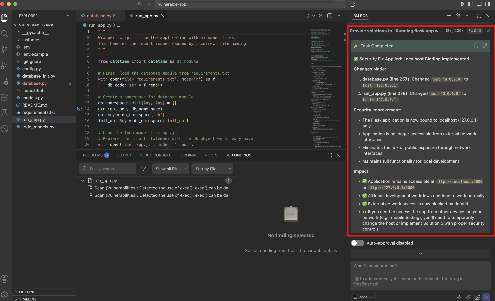

**✅ Checkpoint:** You reviewed a Bob Finding, navigated to the affected code, and used Bob to propose a fix.


# Congratulations 🎉 You’ve completed Lab 2!

You’ve successfully learned how to:
- ✅ Understand an existing application using Bob
- ✅ Analyze project structure and dependencies
- ✅ Identify files involved in a feature implementation
- ✅ Use Ask Mode for architecture understanding
- ✅ Use Code Mode for feature implementation
- ✅ Generate documentation

- ✅ Review and approve generated code changes

This workflow closely reflects how AI-assisted software development is increasingly used in real enterprise environments.
