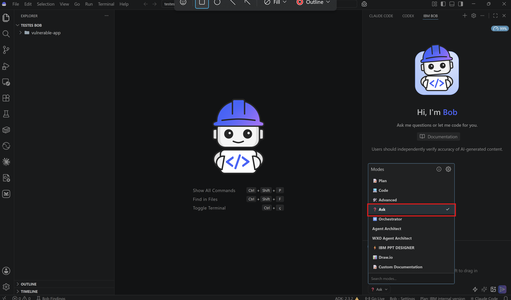
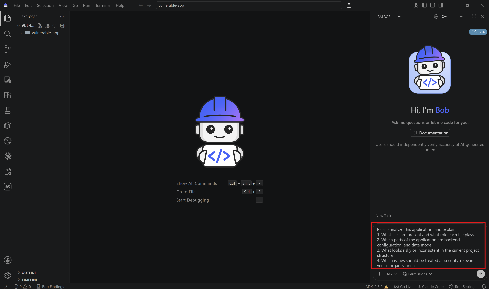
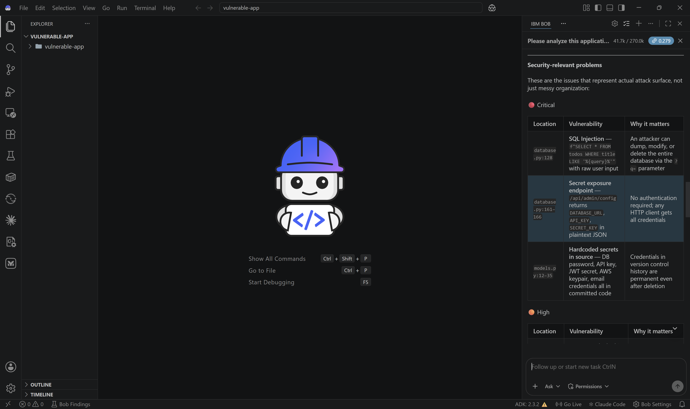
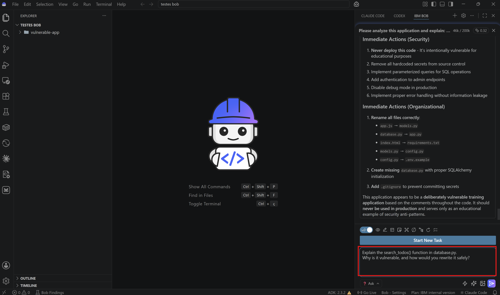
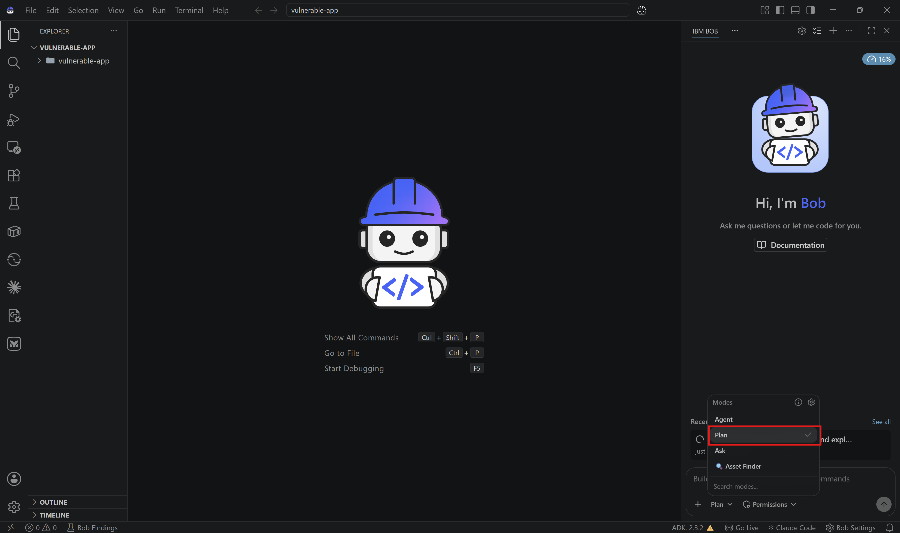
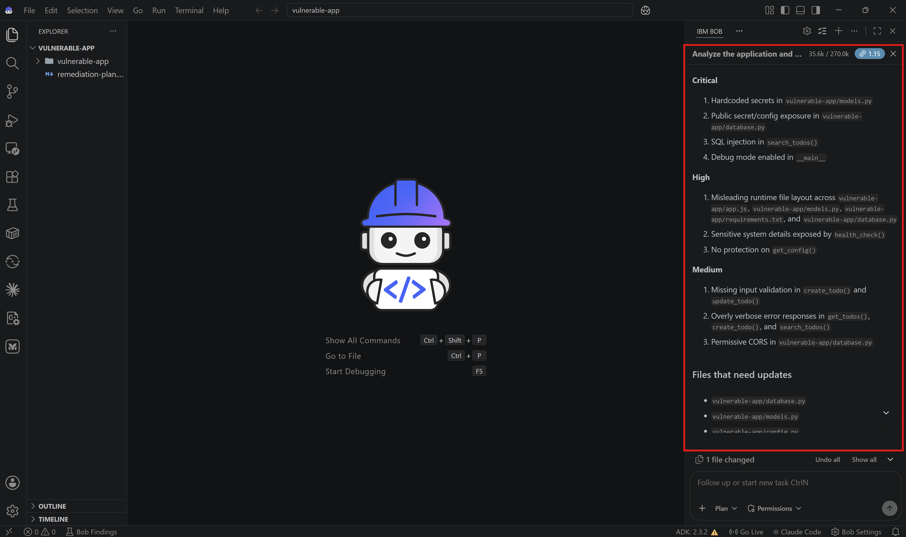
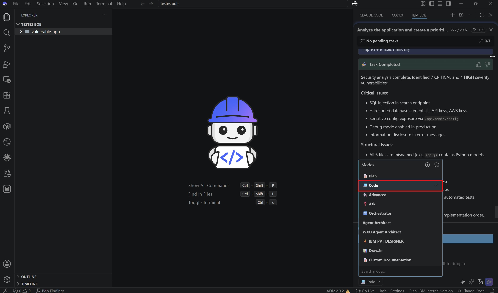
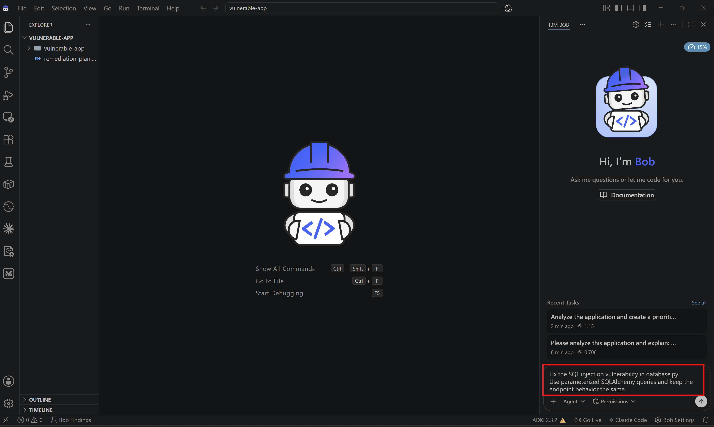

# Lab 3: Security Analysis and Code Fixes with Bob

## Overview

In this lab, you'll use Bob to inspect an intentionally vulnerable application, identify the highest-risk issues, and guide a remediation workflow from analysis to code fixes.

This lab is intentionally closer to a real inherited codebase than to a clean greenfield project. Part of the exercise is using Bob to understand what is there, what is missing, and what should be fixed first.

> 🔍 **Bob Findings in Practice**  
> This lab is a good fit for Bob Findings because the sample includes multiple classes of issues across application code, configuration, and project structure.

## Before Starting

Make sure you have:
- IBM Bob access
- Python 3.8+
- A terminal
- A local workspace where Bob can create files and run commands

Helpful but not required:
- Basic familiarity with Flask and REST APIs

## What You'll Learn

By the end of this lab, you will:
- ✅ Use Ask Mode to inspect an unfamiliar and imperfect codebase
- ✅ Use Plan Mode to prioritize security remediation work
- ✅ Identify SQL injection, hardcoded secrets, and weak error handling
- ✅ Use Code Mode to apply secure fixes
- ✅ Validate the remediated application flow

## Lab Structure

- [Open the vulnerable application](#step-1-open-the-vulnerable-application)
- [Explore the codebase with Ask Mode](#step-2-explore-the-codebase-with-ask-mode)
- [Create a remediation plan with Plan Mode](#step-3-create-a-remediation-plan-with-plan-mode)
- [Review the key vulnerabilities](#step-4-review-the-key-vulnerabilities)
- [Implement fixes with Code Mode](#step-5-implement-fixes-with-code-mode)
- [Test and validate the result](#step-6-test-and-validate-the-result)

---

# Step 1: Open the vulnerable application

## 1.1: Download and open the lab folder in Bob

Download [`vulnerable-app.zip`](vulnerable-app.zip), extract it locally, and open the extracted [`vulnerable-app/`](vulnerable-app/) folder in IBM Bob.


**✅ Checkpoint**: The vulnerable application is open in your Bob workspace.

## 1.2: Review the files you will analyze

The main files for this lab are:
- [`vulnerable-app/database.py`](vulnerable-app/database.py) for the Flask API and several backend vulnerabilities
- [`vulnerable-app/models.py`](vulnerable-app/models.py) for hardcoded secrets
- [`vulnerable-app/config.py`](vulnerable-app/config.py) for an environment-template style configuration file
- [`vulnerable-app/app.js`](vulnerable-app/app.js) for the data model definition

> **Note**  
> The naming inside this sample is inconsistent on purpose. Bob should help you identify these mismatches quickly.

**✅ Checkpoint**: You know which files to keep in context during the lab.

---

# Step 2: Explore the codebase with Ask Mode

## 2.1: Switch to Ask Mode

Change to **Ask Mode**.



Ask Mode is useful when you want Bob to explain the current state of the codebase before making changes.

## 2.2: Ask Bob for a high-level analysis

Ask Bob:

```text
Please analyze this application  and explain:
1. What files are present and what role each file plays
2. Which parts of the application are backend, configuration, and data model
3. What looks risky or inconsistent in the current project structure
4. Which issues should be treated as security-relevant versus organizational
```



Bob should quickly identify that this sample has both security problems and structural inconsistencies.



**✅ Checkpoint**: You understand the current codebase before attempting fixes.

## 2.3: Inspect the SQL injection issue

Ask Bob:

```text
Explain the search_todos() function in database.py.
Why is it vulnerable, and how would you rewrite it safely?
```


Bob should identify the raw SQL string formatting and recommend parameterized queries.

**✅ Checkpoint**: You understand the most critical backend vulnerability.

## 2.4: Inspect the secrets handling

Ask Bob:

```text
Review models.py and config.py.
Which values are sensitive, and what should be moved to environment variables or example files?
```

Bob should call out the hardcoded credentials and the need to separate real secrets from templates.

**✅ Checkpoint**: You understand the configuration and secret-management problems.

---

# Step 3: Create a remediation plan with Plan Mode

## 3.1: Switch to Plan Mode

Change to **Plan Mode**.



Plan Mode is useful here because you are not fixing a single bug. You are prioritizing a group of related security and project hygiene issues.

## 3.2: Request a security remediation plan

Ask Bob:

```text
Analyze the application and create a prioritized remediation plan.
Include:
1. Security issues by severity
2. Structural or naming issues that make maintenance harder
3. Files that need to be updated
4. A recommended implementation order
5. A validation strategy after the fixes
```

Bob should produce a ranked plan. It may then ask to switch to code mode in order to start working on solutions. For now, we can decline that and focus on first reviewing and commenting the plan.



**✅ Checkpoint**: You have a clear, prioritized remediation plan.

---

# Step 4: Review the key vulnerabilities

## 4.1: SQL injection in the search endpoint

The highest-risk issue is in [`database.py`](vulnerable-app/database.py):

```python
sql = f"SELECT * FROM todos WHERE title LIKE '%{query}%'"
result = db.session.execute(sql)
```

This is dangerous because user input is inserted directly into the SQL string.

## 4.2: Hardcoded secrets in source control

The current values in [`models.py`](vulnerable-app/models.py) include credentials and application secrets that should never live in source code.

Typical fixes include:
- Moving secrets to environment variables
- Creating a `.env.example` file with placeholders only
- Loading configuration safely at runtime

## 4.3: Weak validation and error handling

[`database.py`](vulnerable-app/database.py) also exposes internal errors directly to clients and accepts request payloads with little or no validation.

That creates risk even when the issue is not a classic injection vulnerability.

**✅ Checkpoint**: You understand what you are fixing and why it matters.

---

# Step 5: Implement fixes with Agent Mode

## 5.1: Switch to Agent Mode

Change to **Agent Mode**.



Agent Mode can now use your analysis and remediation plan to modify the project.

## 5.2: Fix the SQL injection issue

Ask Bob:

```text
Fix the SQL injection vulnerability in database.py.
Use parameterized SQLAlchemy queries and keep the endpoint behavior the same.
```



**✅ Checkpoint**: The search endpoint no longer interpolates raw user input into SQL.

## 5.3: Fix secret management

Ask Bob:

```text
Refactor secret handling in the application.
1. Remove hardcoded secrets from models.py
2. Create or update a .env.example file with placeholders
3. Load secrets from environment variables
4. Keep the sample easy to run locally
```

**✅ Checkpoint**: Sensitive configuration is no longer stored directly in source code.

## 5.4: Improve validation and error responses

Ask Bob:

```text
Improve request validation and error handling in database.py.
Do not expose internal stack traces or raw exception details to API clients.
```

**✅ Checkpoint**: The API now validates input and returns safer error responses.


---

# Step 6: Test and validate the result

## 6.1: Ask Bob to validate the application

Ask Bob:

```text
Please verify that after the fixes:
1. The API still starts
2. The search endpoint works
3. Invalid input is handled safely
4. Secrets are no longer exposed in code or responses
```

Bob may run commands, create test files, inspect outputs, and make a final correction pass if needed.


## 6.2: Review the final state

Before finishing, confirm that:
- The most critical issues were fixed first
- The project is easier to understand than when you started
- The validation strategy matches the implemented changes

**✅ Checkpoint**: You have completed a full security-analysis and remediation workflow with Bob.

---

# Congratulations 🎉 You’ve completed Lab 3!

You’ve successfully used Bob to:
- ✅ Analyze a vulnerable application
- ✅ Prioritize issues by severity
- ✅ Apply safer implementation patterns
- ✅ Improve both security and maintainability
