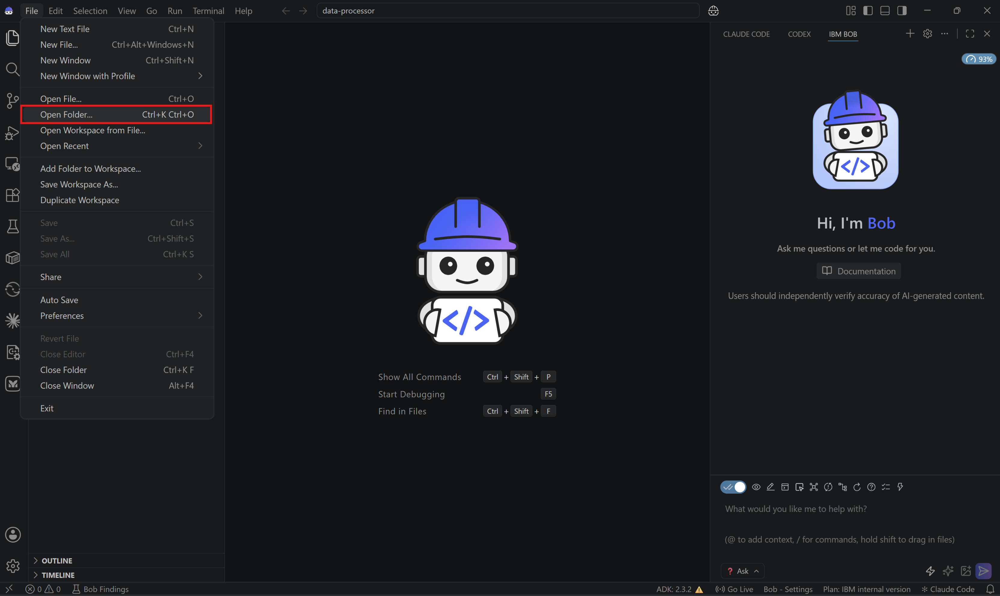
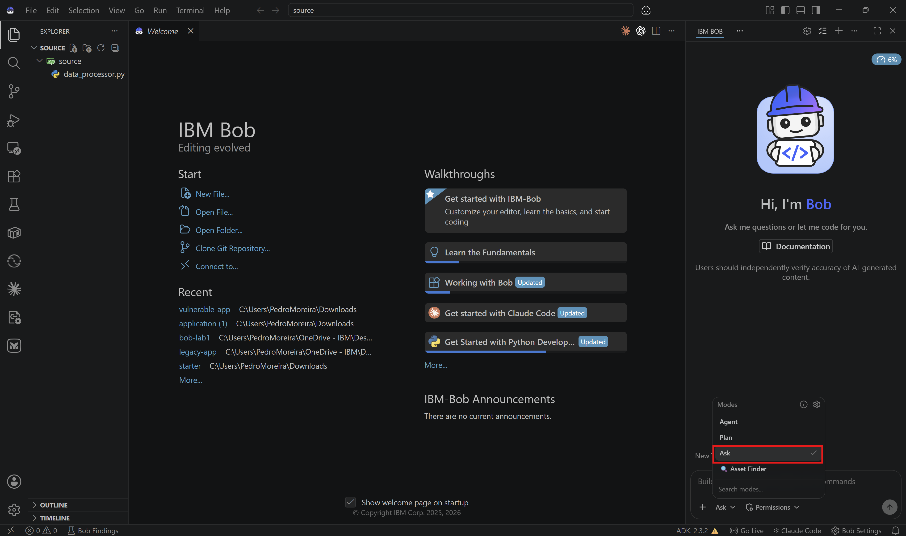
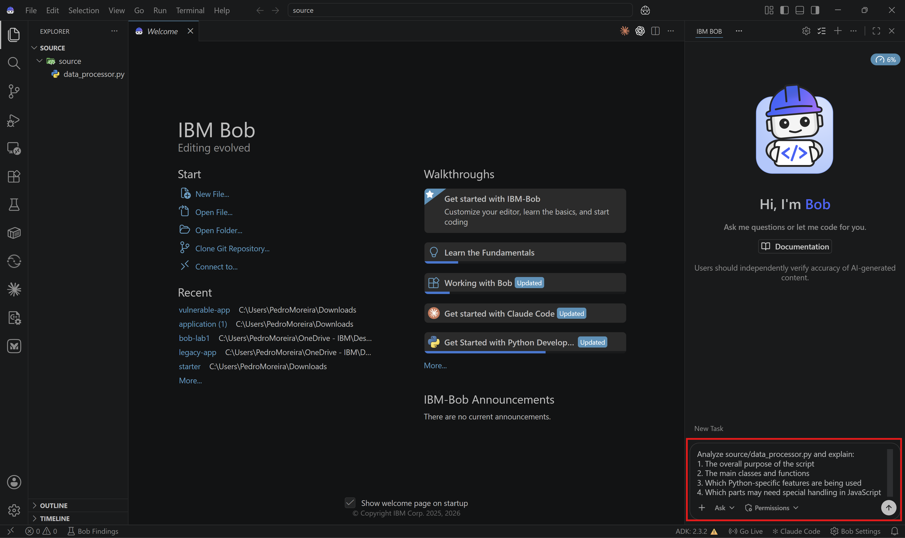
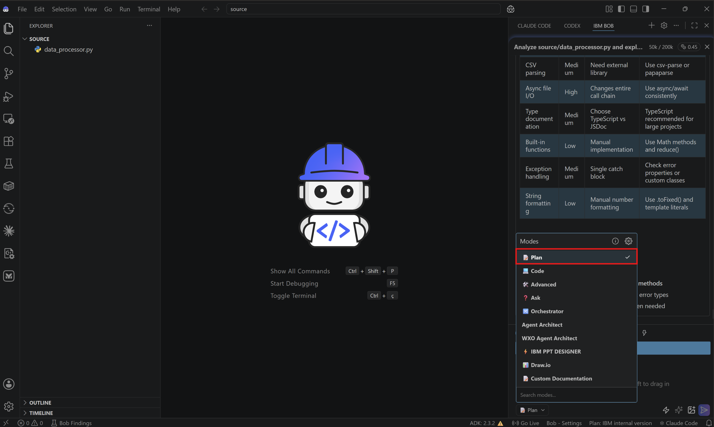
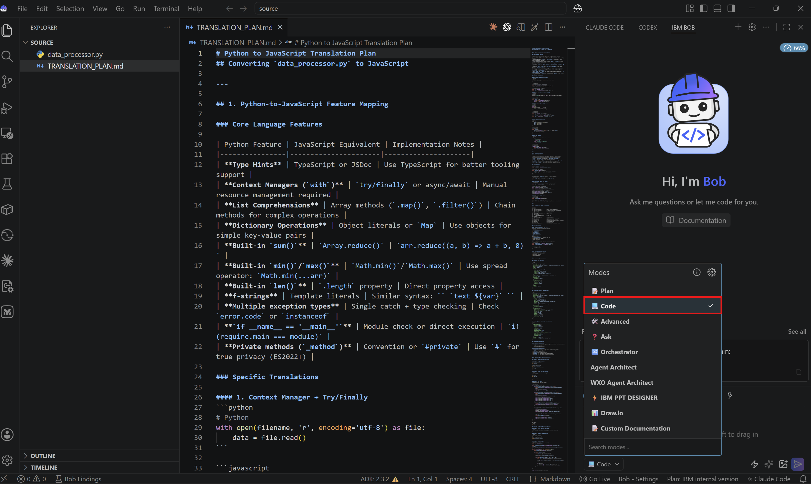
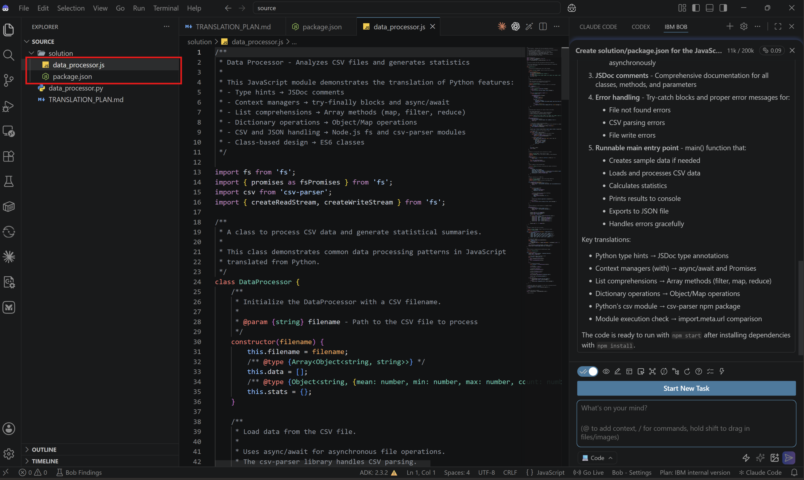
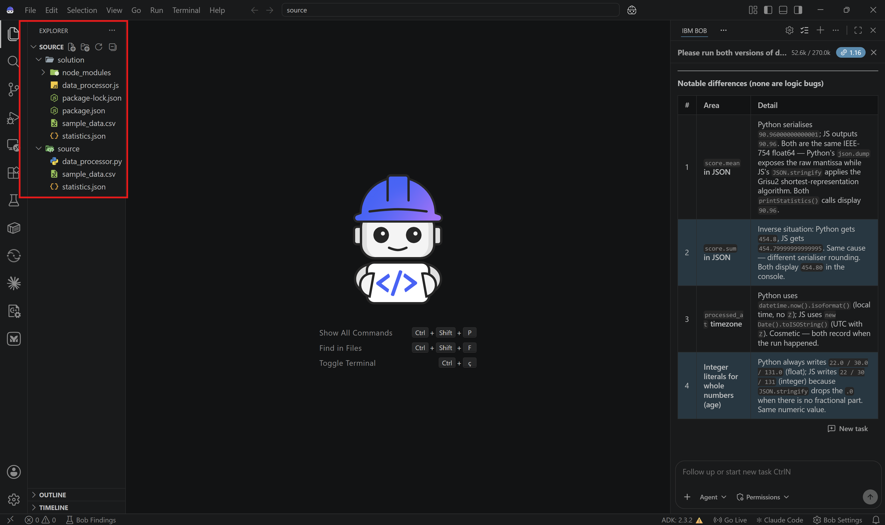

# Lab 4: Code Translation - Python to JavaScript with Bob

## Overview

In this lab, you'll use Bob to translate a Python data-processing script into an equivalent JavaScript implementation while preserving functionality and applying language-specific best practices.

This reflects a common real-world scenario where teams modernize utilities, port internal tools, or move logic between runtimes without rewriting everything manually.

## Before Starting

Make sure you have:
- IBM Bob access
- Python 3.8+
- Node.js 14+
- A terminal
- A local workspace where Bob can create files and run commands

Helpful but not required:
- Basic familiarity with Python and JavaScript


## What You'll Translate

You will translate the Python source file [`source/data_processor.py`](source/data_processor.py) into a Node.js implementation.

The Python script:
- Reads CSV files
- Performs statistical calculations
- Exports results to JSON

## What You'll Learn

By the end of this lab, you will:
- ✅ Use Ask Mode to understand the source code
- ✅ Use Plan Mode to design a translation strategy
- ✅ Use Code Mode to implement the JavaScript version
- ✅ Compare Python features with JavaScript equivalents
- ✅ Validate that both versions produce the same outcome

## Lab Structure

- [Review the Python source](#step-1-review-the-python-source)
- [Plan the translation](#step-2-plan-the-translation)
- [Implement the JavaScript version](#step-3-implement-the-javascript-version)
- [Verify and compare both versions](#step-4-verify-and-compare-both-versions)

---

# Step 1: Review the Python source

## 1.1: Download and open the lab folder in Bob

Download the lab files ZIP [here](source.zip). Extract it to a new local folder and open that extracted folder in IBM Bob before starting the exercise.



Review the code structure and pay attention to:
- Class-based design
- Type hints
- Context managers such as `with open(...)`
- List comprehensions
- Dictionary operations
- CSV and JSON handling

**✅ Checkpoint**: You have reviewed the Python source file.

## 1.2: Switch to Ask Mode

Change to **Ask Mode**.



## 1.3: Ask Bob to explain the code

Ask Bob:

```text
Analyze source/data_processor.py and explain:
1. The overall purpose of the script
2. The main classes and functions
3. Which Python-specific features are being used
4. Which parts may need special handling in JavaScript
```



Bob should identify file Input/Output, list processing, JSON export, and the `DataProcessor` class design.

**✅ Checkpoint**: You understand the Python implementation before translating it.

## 1.4: Ask about translation challenges

Still in **Ask Mode**, ask Bob:

```text
What challenges should we expect when translating source/data_processor.py from Python to JavaScript?
Consider syntax, libraries, async file handling, and type documentation.
```

Bob should highlight differences such as:
- `with open(...)` versus Node.js file and stream APIs
- `csv.DictReader` versus `csv-parser`
- Type hints versus JSDoc
- List comprehensions versus array methods

**✅ Checkpoint**: You understand the main translation challenges.

---

# Step 2: Plan the translation

## 2.1: Switch to Plan Mode

Change to **Plan Mode**.



## 2.2: Create a translation mapping

Ask Bob:

```text
Create a file with the translation plan for converting source/data_processor.py to JavaScript.
Include:
1. Python-to-JavaScript feature mapping
2. Library equivalents
3. Proposed file layout in solution/
4. Any dependency recommendations
5. Validation steps after implementation
```

Bob should produce a clear mapping before any code is written.

**✅ Checkpoint**: You have a concrete translation plan.

---

# Step 3: Implement the JavaScript version

## 3.1: Switch to Code Mode

Change to **Code Mode**.



## 3.2: Create or update the package configuration

Ask Bob:

```text
Create solution/package.json for the JavaScript translation.
Use Node.js, set data_processor.js as the entry point, and add the dependencies needed for CSV parsing.
```

**✅ Checkpoint**: The JavaScript project configuration is ready.

## 3.3: Translate the Python class

Ask Bob:

```text
Translate source/data_processor.py into solution/data_processor.js.
Include:
1. An equivalent DataProcessor class
2. Async file handling where appropriate
3. JSDoc comments
4. Error handling
5. A runnable main entry point
```

Bob should generate the translated implementation in the `solution/` folder.



**✅ Checkpoint**: The JavaScript version has been created.

## 3.4: Ask Bob to explain the translation choices

After the file is generated, switch back to **Ask Mode** and ask:

```text
Explain the key translation decisions in solution/data_processor.js.
Focus on file I/O, array transformations, error handling, and how the Python main block was mapped to Node.js.
```

This is useful because translation is not only about syntax. It is also about choosing the right runtime patterns.

**✅ Checkpoint**: You understand the translated solution, not just the generated code.

---

# Step 4: Verify and compare both versions

## 4.1: Run and compare the two versions of data_processor

Switch back to Code mode and ask Bob:

```text
Please run both versions of data_processor: python and javascript.
Compare their outputs and confirm whether both implementations create equivalent CSV-processing and JSON-export behavior.
```

Review the generated output and result files together.



**✅ Checkpoint**: Both implementations behave consistently.

---

# Congratulations 🎉 You’ve completed Lab 4!

You’ve successfully used Bob to:
- ✅ Analyze Python code
- ✅ Plan a language translation
- ✅ Generate a JavaScript implementation
- ✅ Compare behavior across runtimes
